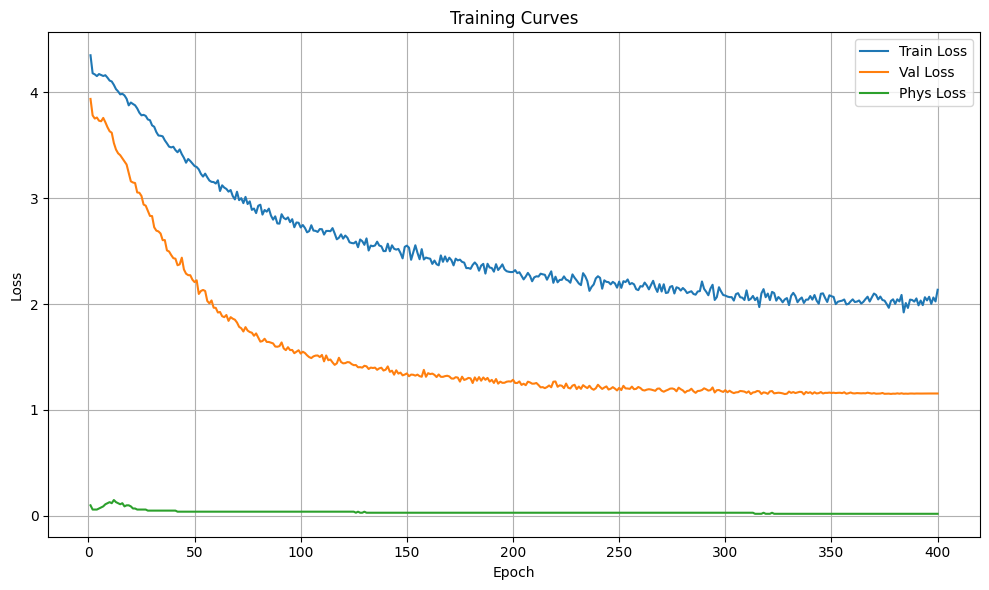
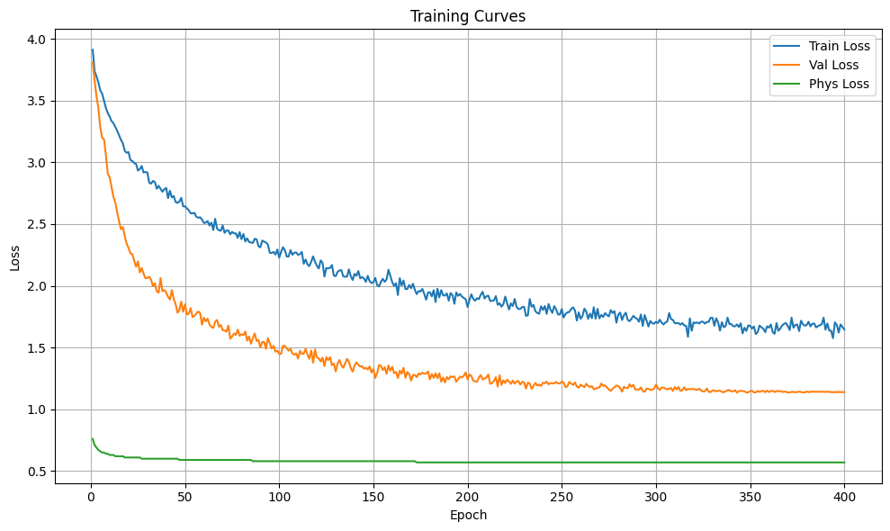

# Sketched Isotropic Gaussian Regularization (SIGReg)

> SIGReg from [LeJEPA: Provable and Scalable Self-Supervised Learning Without the Heuristics](https://arxiv.org/abs/2511.08544) (arXiv: 2511.08544).

We present extension to LeJEPA analysis and proof regarding SIGReg and implement it as practical tool for training neural net beyond Self-Supervised Learning paradigm. We use SIGReg as regularization term to constraint internal hidden states of neural net, dicover free-lunch optimization stability, and formulate simpler version called Weak-SIGReg. Weak-SIGReg retain the stabilization effect of Strong SIGReg (from LeJEPA), but with cheaper algorithm and optimal convergence rate.

## Strong SIGReg (from LeJEPA):

```python
def sigreg_strong_loss(x, sketch_dim=64):
    """
    Forces ECF(x) ~ ECF(Gaussian).
    Matches ALL Moments (Maximum Entropy Cloud).
    Exact implementation of LeJEPA Algorithm 1.
    """
    N, C = x.size()

    # 1. Projection (The Observer)
    # Project channels down to sketch_dim
    A = torch.randn(C, sketch_dim, device=x.device)
    A = A / (A.norm(p=2, dim=0, keepdim=True) + 1e-6)

    # 2. Integration Points
    t = torch.linspace(-5, 5, 17, device=x.device)

    # 3. Theoretical Gaussian CF
    exp_f = torch.exp(-0.5 * t**2)

    # 4. Empirical CF
    # proj: [N, sketch_dim]
    proj = x @ A

    # args: [N, sketch_dim, T]
    args = proj.unsqueeze(2) * t.view(1, 1, -1)

    # ecf: [sketch_dim, T] (Mean over batch)
    ecf = torch.exp(1j * args).mean(dim=0)

    # 5. Weighted L2 Distance
    # |ecf - gauss|^2 * gauss_weight
    diff_sq = (ecf - exp_f.unsqueeze(0)).abs().square()
    err = diff_sq * exp_f.unsqueeze(0)

    # 6. Integrate
    loss = torch.trapz(err, t, dim=1) * N

    return loss.mean()
```

## Weak SIGReg (new formulation from ours):

```python
def sigreg_weak_loss(x, sketch_dim=64):
    """
    Forces Covariance(x) ~ Identity.
    Matches the 2nd Moment (Spherical Cloud).
    """
    N, C = x.size()
    # 1. Sketching (Optional for C=512, but good for consistency)
    if C > sketch_dim:
        S = torch.randn(sketch_dim, C, device=x.device) / (C ** 0.5)
        x = x @ S.T  # [N, sketch_dim]
    else:
        sketch_dim = C

    # 2. Centering & Covariance
    x = x - x.mean(dim=0, keepdim=True)
    cov = (x.T @ x) / (N - 1 + 1e-6)

    # 3. Target Identity
    target = torch.eye(sketch_dim, device=x.device)

    # 4. Off-diagonal suppression + Diagonal maintenance
    return torch.norm(cov - target, p='fro')
```

## Interesting Result

One of the nastiest comparison happen between sample with this setup:
- ViT (Vision Transformer)
- AdamW optimizer
- Heavy data augmentation (RandomCrop, RandomHorizontalFlip, RandAugment, CutMix, and MixUp)

Top-1 accuracy on CIFAR-100:
- Without SIGReg: 20.73%
- With Strong SIGReg: 70.20%
- With Weak SIGReg: 72.02%

Loss curve on CIFAR-100:
- Without SIGReg: 
    
- With Strong SIGReg: 
    
- With Weak SIGReg: 
    