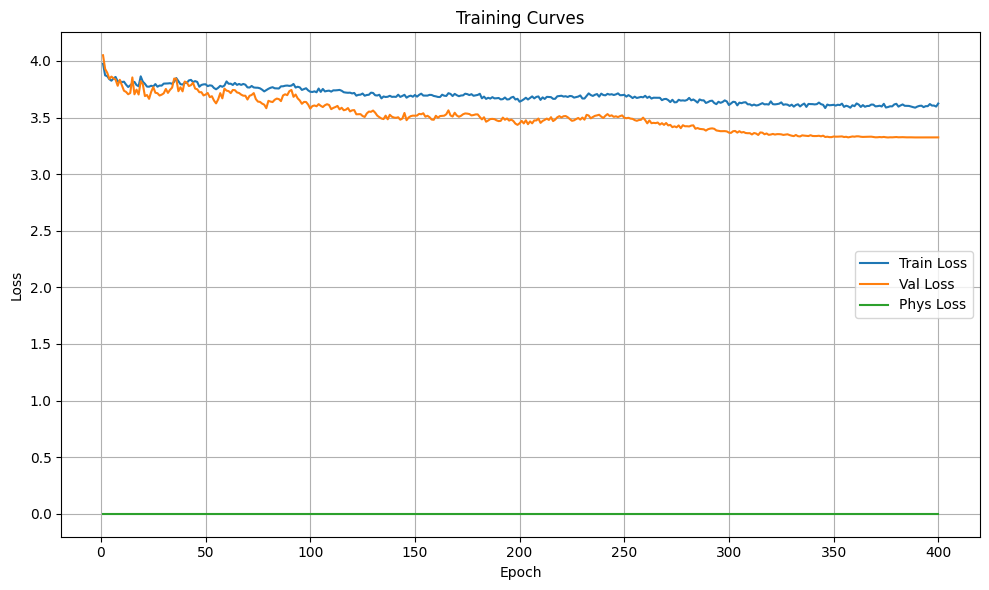
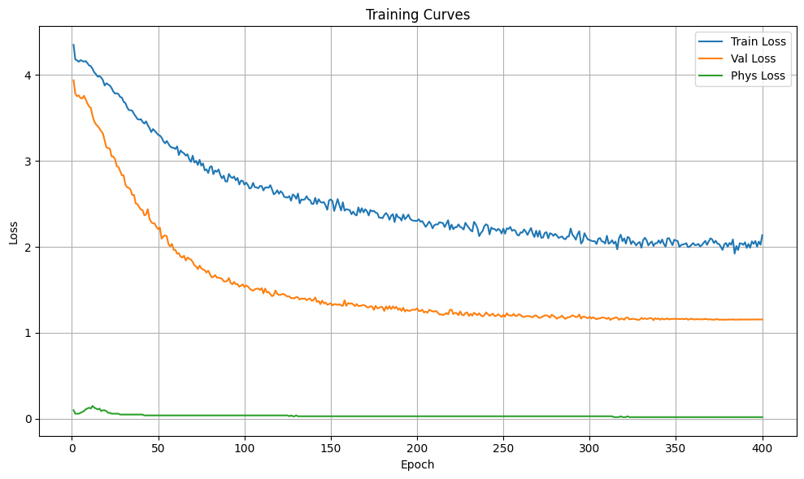
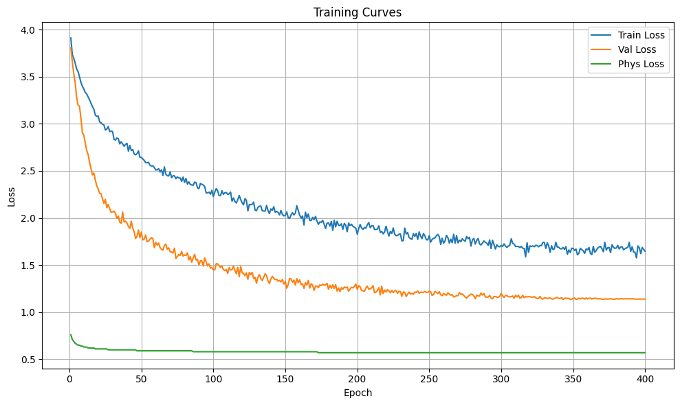

# Sketched Isotropic Gaussian Regularization (SIGReg)

> SIGReg from [LeJEPA: Provable and Scalable Self-Supervised Learning Without the Heuristics](https://arxiv.org/abs/2511.08544) (arXiv: 2511.08544).


We present extension to LeJEPA analysis and proof regarding SIGReg and implement it as practical tool for training neural net beyond Self-Supervised Learning paradigm. We use SIGReg as regularization term to constraint internal hidden states of neural net, dicover free-lunch optimization stability, and formulate simpler version called Weak-SIGReg. Weak-SIGReg retain the stabilization effect of Strong SIGReg (from LeJEPA), but with cheaper algorithm and optimal convergence rate.

## Strong SIGReg (from LeJEPA):

```python
def sigreg_strong_loss(x, sketch_dim=64):
    """
    Forces ECF(x) ~ ECF(Gaussian).
    Matches ALL Moments (Maximum Entropy Cloud).
    Exact implementation of LeJEPA Algorithm 1.
    """
    N, C = x.size()

    # 1. Projection (The Observer)
    # Project channels down to sketch_dim
    A = torch.randn(C, sketch_dim, device=x.device)
    A = A / (A.norm(p=2, dim=0, keepdim=True) + 1e-6)

    # 2. Integration Points
    t = torch.linspace(-5, 5, 17, device=x.device)

    # 3. Theoretical Gaussian CF
    exp_f = torch.exp(-0.5 * t**2)

    # 4. Empirical CF
    # proj: [N, sketch_dim]
    proj = x @ A

    # args: [N, sketch_dim, T]
    args = proj.unsqueeze(2) * t.view(1, 1, -1)

    # ecf: [sketch_dim, T] (Mean over batch)
    ecf = torch.exp(1j * args).mean(dim=0)

    # 5. Weighted L2 Distance
    # |ecf - gauss|^2 * gauss_weight
    diff_sq = (ecf - exp_f.unsqueeze(0)).abs().square()
    err = diff_sq * exp_f.unsqueeze(0)

    # 6. Integrate
    loss = torch.trapz(err, t, dim=1) * N

    return loss.mean()
```

## Weak SIGReg (new formulation from ours):

```python
def sigreg_weak_loss(x, sketch_dim=64):
    """
    Forces Covariance(x) ~ Identity.
    Matches the 2nd Moment (Spherical Cloud).
    """
    N, C = x.size()
    # 1. Sketching (Optional for C=512, but good for consistency)
    if C > sketch_dim:
        S = torch.randn(sketch_dim, C, device=x.device) / (C ** 0.5)
        x = x @ S.T  # [N, sketch_dim]
    else:
        sketch_dim = C

    # 2. Centering & Covariance
    x = x - x.mean(dim=0, keepdim=True)
    cov = (x.T @ x) / (N - 1 + 1e-6)

    # 3. Target Identity
    target = torch.eye(sketch_dim, device=x.device)

    # 4. Off-diagonal suppression + Diagonal maintenance
    return torch.norm(cov - target, p='fro')
```

## Results CIFAR-100

| Model    | Optimizer  | CutMix/MixUp | SIGReg | Epochs | Top-1 Acc |
|----------|------------|--------------|--------|--------|-----------|
| ResNet18 | SGD        | No           | No     | 1600   | 79.03%    |
| ResNet18 | SGD        | No           | Strong | 1600   | 78.86%    |
| ResNet18 | SGD        | No           | Weak   | 1600   | 79.42%    |
| ResNet18 | SGD        | Yes          | No     | 400    | 82.13%    |
| ResNet18 | SGD        | Yes          | Strong | 400    | 81.18%    |
| ResNet18 | SGD        | Yes          | Weak   | 400    | 82.13%    |
| ViT      | AdamW      | Yes          | No     | 400    | 20.73%    |
| ViT      | AdamW      | Yes          | Strong | 400    | 70.20%    |
| ViT      | AdamW      | Yes          | Weak   | 400    | 72.02%    |
| ViT      | Muon+AdamW | No           | No     | 400    | 58.77%    |
| ViT      | Muon+AdamW | No           | Strong | 400    | 63.16%    |
| ViT      | Muon+AdamW | No           | Weak   | 400    | 67.52%    |
| ViT      | Muon+AdamW | Yes          | No     | 400    | 62.44%    |
| ViT      | Muon+AdamW | Yes          | Strong | 400    | 74.34%    |
| ViT      | Muon+AdamW | Yes          | Weak   | 400    | 74.56%    |

## Interesting Findings

One of the nastiest comparison happen between sample with this setup:
- ViT (Vision Transformer)
- AdamW optimizer
- Heavy data augmentation (RandomCrop, RandomHorizontalFlip, RandAugment, CutMix, and MixUp)

Top-1 accuracy on CIFAR-100:
- Without SIGReg: 20.73%
- With Strong SIGReg: 70.20%
- With Weak SIGReg: 72.02%

Loss curve on CIFAR-100:
- Without SIGReg: 
    
- With Strong SIGReg: 
    
- With Weak SIGReg: 
    

## Fixing ViT Baseline

Because we find ViT + AdamW baseline perform very poorly, we test it on specific setup to ensure peak baseline performance. Few intervention we choose are:
- Using specific model shape.
- Using different weight decay.
- Using absolute position embedding, not per layer 2D RoPE.
- Using specific initialization.
- Using gradient clipping.
- Using LR Scheduler eta_min = 1e-5.
- Using different mean and std for CIFAR-100 dataset.
- Using drop path rate of 0.1 without dropout.
- Write manual attention forward pass.
- Using QKV bias.

The results after ViT intervention:

| Model    | Optimizer  | CutMix/MixUp | SIGReg | Epochs | Top-1 Acc |
|----------|------------|--------------|--------|--------|-----------|
| ViT      | AdamW      | Yes          | No     | 400    | 70.76%    |
| ViT      | AdamW      | Yes          | Strong | 400    | 72.71%    |
| ViT      | AdamW      | Yes          | Weak   | 400    | 71.65%    |
| ViT      | Muon+AdamW | Yes          | No     | 400    | 75.87%    |
| ViT      | Muon+AdamW | Yes          | Strong | 400    | 76.98%    |
| ViT      | Muon+AdamW | Yes          | Weak   | 400    | 76.24%    |

## Vanilla MLP Experiments

We test vanilla MLP on CIFAR-100 dataset to show the effect of SIGReg on simple model. We use MLP with this setup:
- 6 layers deep.
- Direct flattened input from image.
- 1024 hidden dimension.
- ReLU activation.
- No dropout.
- No batch norm.
- No residual connection.
- Pure SGD optimizer without momentum.
- No LR Scheduler.
- No weight decay.

| Model    | Optimizer  | CutMix/MixUp | SIGReg | Epochs | Top-1 Acc |
|----------|------------|--------------|--------|--------|-----------|
| MLP      | SGD        | No           | No     | 400    | 26.77%    |
| MLP      | SGD        | No           | Strong | 400    | 35.99%    |
| MLP      | SGD        | No           | Weak   | 400    | 42.17%    |
| MLP      | SGD        | Yes          | No     | 400    | 38.08%    |
| MLP      | SGD        | Yes          | Strong | 400    | 38.70%    |
| MLP      | SGD        | Yes          | Weak   | 400    | 38.40%    |

The possible explanation why CutMix/MixUp version perform worse for weak SIGReg is that 400 epochs is not enough to converge into higher ceiling because the last recorded loss is still decreasing, since this is flat LR schedule. While no CutMix/MixUp version can converge much faster.

> Note: MLP experiments mistakenly still uses gradient clipping, we will test it without gradient clipping in the future.

## ImageNet Experiments

We test SIGReg on [ILSVRC/imagenet-1k](https://huggingface.co/datasets/ILSVRC/imagenet-1k) dataset with ViT model.

| Model            | Optimizer  | CutMix/MixUp | SIGReg | Epochs | Top-1 Acc |
|------------------|------------|--------------|--------|--------|-----------|
| ViT-Tiny/16      | Muon+AdamW | Yes          | No     | 200    | 69.18%    |
| ViT-Tiny/16      | Muon+AdamW | Yes          | Strong | 200    | 69.28%    |
| ViT-Tiny/16      | Muon+AdamW | Yes          | Weak   | 200    | 72.62%    |

> Note: We use from-scratch pretraining without distillation from larger teacher model.

Comparison with existing technique:

| Model                     | Parameters | Pretraining Data     | Distillation    | Epochs      | Top-1 Acc (%) | Key Reference                                                                                                                               |
| ------------------------- | ---------- | -------------------- | --------------- | ----------- | ------------- | ------------------------------------------------------------------------------------------------------------------------------------------- |
| ViT-Tiny (original)       | 5.7M       | ImageNet-1K only     | None            | 300         | 72.2          | [A Closer Look at Self-Supervised Lightweight Vision Transformers](https://proceedings.mlr.press/v202/wang23e/wang23e.pdf)                  |
| DeiT-Tiny                 | 5.6M       | ImageNet-1K only     | None            | 300         | 72.2          | [Training data-efficient image transformers & distillation through attention](https://proceedings.mlr.press/v139/touvron21a/touvron21a.pdf) |
| ViT-Tiny (enhanced)       | 5.7M       | ImageNet-1K only     | None            | 300         | 74.5          | [A Closer Look at Self-Supervised Lightweight Vision Transformers](https://proceedings.mlr.press/v202/wang23e/wang23e.pdf)                  |
| DeiT-Tiny (distilled)     | 6M         | ImageNet-1K only     | Logit (DeiT)    | 300         | 74.5          | [Training data-efficient image transformers & distillation through attention](https://proceedings.mlr.press/v139/touvron21a/touvron21a.pdf) |
| DeiT-Tiny (ViTKD)         | 5.6M       | ImageNet-1K only     | Feature         | 300–400     | 76.06         | [ViTKD: Feature-based Knowledge Distillation for Vision Transformers](https://openaccess.thecvf.com/content/CVPR2024W/PBDL/papers/Yang_ViTKD_Feature-based_Knowledge_Distillation_for_Vision_Transformers_CVPRW_2024_paper.pdf) |
| DeiT-Tiny (manifold)      | 5.6M       | ImageNet-1K only     | Feature (patch) | 300         | 76.5          | [Learning Efficient Vision Transformers via Fine-Grained Manifold Distillation](https://proceedings.nips.cc/paper_files/paper/2022/file/3bd2d73b4e96b0ac5a319be58a96016c-Paper-Conference.pdf) |
| DeiT-Tiny (ViTKD+NKD)     | 6M         | ImageNet-1K only     | Hybrid          | 300–400     | 77.78         | [ViTKD: Practical Guidelines for ViT feature knowledge distillation](https://arxiv.org/abs/2209.02432)                                      |
